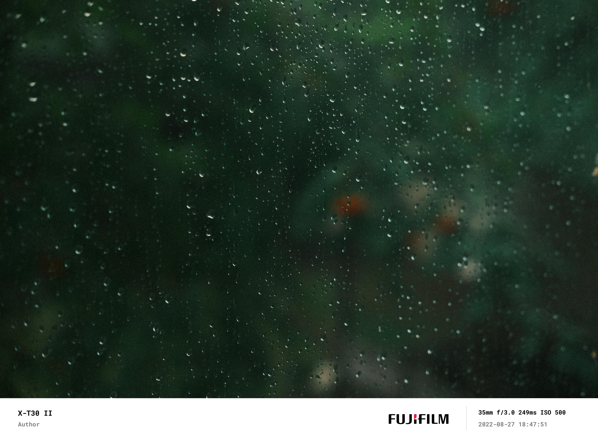

# EXIF Banner Generator

This script attaches a banner to the bottom of an image. The banner shows the camera brand, author, EXIF info, and datetime.

## Dependency

The python environment is managed by pipenv. To install the environment, run

```python
pipenv install
```

## Usage
The script comes with two compulsory and three optional arguments.

- **image_dir**: Directory containing image files.
- **author**: Name of the author
- **-d (optional)**: a short description will be added at the center of the banner
- **-f (optional)**: Path to the desired font file (currently only ttf is supported), the default value is `fonts/font.ttf`.
- **-i (optional)**: Path to the desired brand icon file (jpg), the default value is `icons/icon.jpg`
- **-r (optional)**: The ratio of original image versus banner (in height), the default value is `10`.

`python run.py` will execute the processing. Processed images will be saved under  the `images/processed` folder.

> Note: no EXIF metadata will remain in processed images.
## Sample

